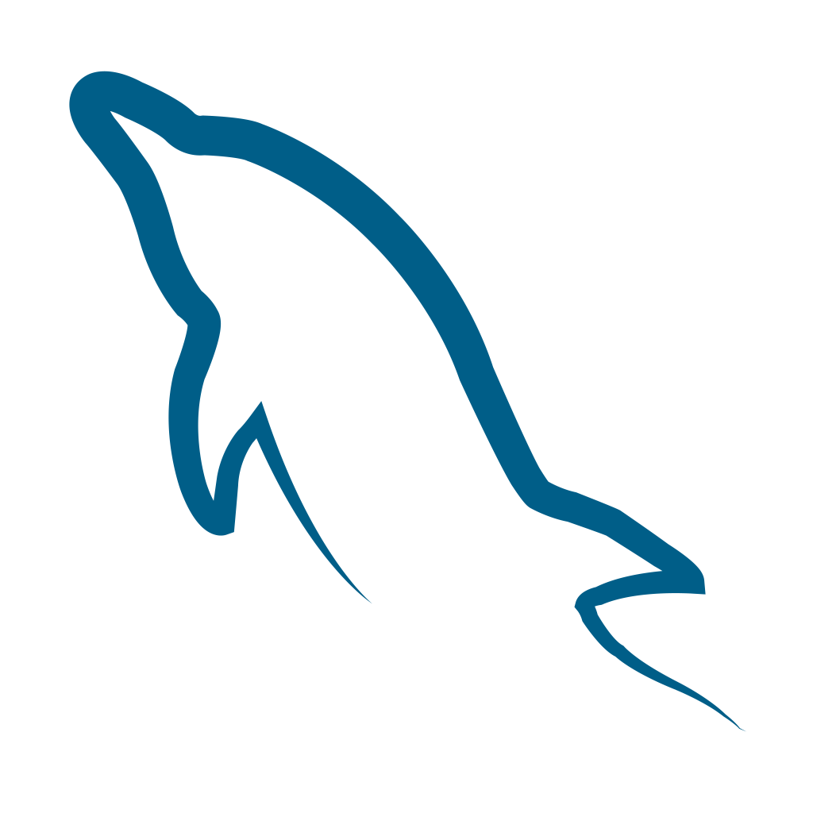

# Hey, I'm [Francois Robbertze](https://www.linkedin.com/in/francoisrob/)

## About me

- Junior Developer from South Africa
- Average nvim enjoyer
- Currently on Fedora, but want to try Nixos next
- 90% of my screen time is probably spent inside a terminal
- My commits look empty, but my work is on BitBucket

`When I'm not busy programming, I code.`

Feel free to connect with me on [LinkedIn](https://www.linkedin.com/in/francoisrob/) to explore opportunities, share ideas, or just have a tech chat!

<!-------------->

<!--### My Skills-->

<!--
-->
<!---->
<!---->
<!---->
<!---->

<!-- RESOURCES BELONG TO THEIR RESPECTIVE OWNERS -->
<!-- https://tenor.com/view/waving-hand-joypixels-hi-hello-hey-there-gif-17554626 -->
<!-- https://github.com/walkxcode/dashboard-icons -->
<!-- https://storyset.com/ for awesome animated SVG -->

----------

<picture>
  <source
    srcset="https://github-readme-stats.vercel.app/api?username=francoisrob&show_icons=true&theme=dark"
    media="(prefers-color-scheme: dark)"
  />
  <source
    srcset="https://github-readme-stats.vercel.app/api?username=francoisrob&show_icons=true"
    media="(prefers-color-scheme: light), (prefers-color-scheme: no-preference)"
  />
  
</picture>
